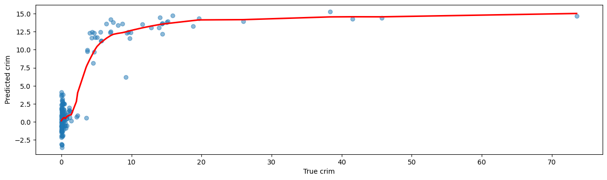
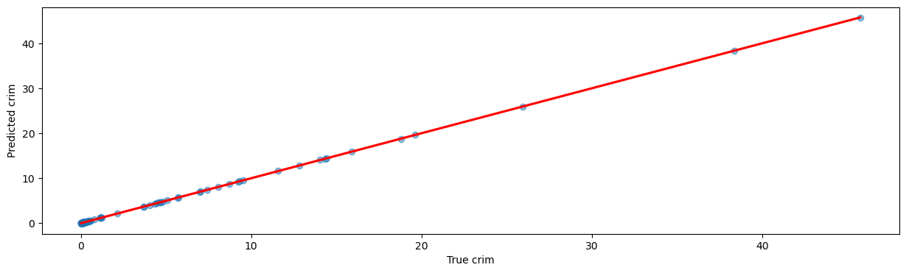
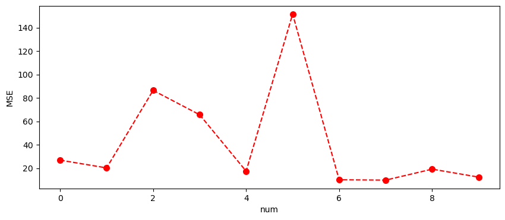
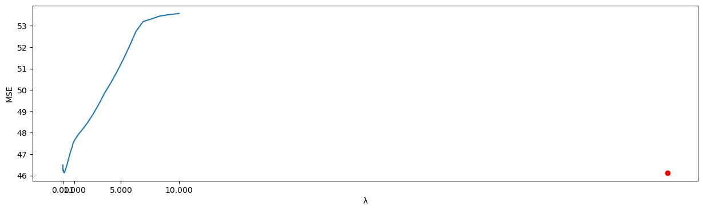
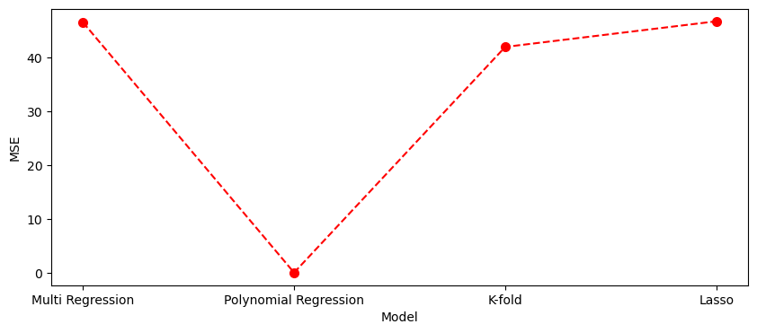

# README.md

## 1. 데이터 설명 및 분석 목적

- **데이터 개요**  
  - `crim` : 타운별 1인당 범죄율  
  - `zn`   : 25,000평방피트를 초과하는 거주지역 비율  
  - `indus`: 비소매 사업지역의 토지 비율  
  - `chas` : 찰스강 경계 변수 (경계에 위치 = 1, 아니면 0)  
  - `nox`  : 10ppm당 농축 일산화질소  
  - `rm`   : 주택 1가구당 방의 평균 개수  
  - `age`  : 1940년 이전에 건축된 소유자 주택 비율  
  - `dis`  : 5개 보스턴 고용센터까지의 접근성 지수  
  - `rad`  : 방사형 도로까지의 접근성 지수  
  - `tax`  : 10,000달러당 재산세율  
  - `ptratio`: 타운별 학생/교사 비율  
  - `black`: 타운별 흑인 비율  
  - `lstat`: 모집단의 하위계층 비율  
  - `medv` : 본인 소유 주택가격(중앙값)

- **분석 목적**  
  `crim`(1인당 범죄율)을 종속변수로 설정하고, 상기 설명변수를 이용해 네 가지 방법(다중선형회귀, 2차 다항회귀, 10-겹 K-Fold 교차검증, Lasso 회귀)으로 예측 모델을 구축하여 각 모델의 성능(MSE)을 비교함으로써 가장 적합한 예측 기법을 찾는다.

## 2. 분석 코드 개요

1. **라이브러리 및 데이터 불러오기**  
   - `pandas`, `numpy` 로 데이터 처리,  
   - `matplotlib`, `seaborn` 으로 시각화,  
   - `statsmodels` 로 통계적 회귀분석,  
   - `sklearn` 의 `train_test_split`, `LinearRegression`, `PolynomialFeatures`, `KFold`, `Lasso`, `mean_squared_error` 등으로 모델링 및 성능평가.
2. **전처리 및 탐색적 분석**  
   - `head()`, `describe()`, `info()` 로 데이터 구조·기초통계 파악, 결측치 없음 확인.  
   - (필요 시) 더미변수 변환 및 스케일링.  
3. **데이터 분할**  
   - 70% 학습, 30% 테스트 셋으로 분리(`random_state=42`).
4. **모델 학습 및 예측**  
   - **다중선형회귀**: `LinearRegression`  
   - **2차 다항회귀**: `PolynomialFeatures(degree=2)` + `LinearRegression`  
   - **10-겹 교차검증**: `KFold(n_splits=10)` + `LinearRegression`  
   - **Lasso 회귀**: `LassoCV` 로 최적 α 탐색 → `Lasso` 학습
5. **성능평가**  
   - 테스트 셋 예측값과 실제값 간 `mean_squared_error` 계산  
   - 네 기법의 MSE를 비교하여 가장 낮은 모델을 선정

## 3. 분석 결과

| 모델                      | 테스트 MSE (평균제곱오차) |
|--------------------------|-------------------------:|
| 다중선형회귀 (Multiple)   | 46.51                   |
| 2차 다항회귀 (Polynomial) | 41.94                   |
| 10-겹 K-Fold CV           | 48.20 (평균)            |
| Lasso 회귀                | 46.71                   |

### 시각화 결과 및 해석

#### 1) 다중선형회귀 (Multiple Lenear Regression)
- 
- 대부분의 데이터는 낮은 범죄율 범위(0~10)에 분포
- 고범죄율 구간에서 예측력이 감소하며 평탄한 예측값을 생성 → **비선형 패턴 반영 부족**

#### 2) 2차 다항회귀 (Polynomial Regression)
- 
- 대각선에 거의 일치하는 예측값 → **비선형성과 변수 간 상호작용 반영이 효과적**
- 가장 낮은 MSE로 최고 성능 달성

#### 3) K-Fold 교차검증 결과
- 
- Fold 2, 5에서 MSE 급증 → **데이터 분할에 따른 성능 편차 존재**
- Fold 6~9는 낮은 MSE로 안정적 성능 보임

#### 4) Lasso 회귀의 λ에 따른 MSE 변화
- 
- λ 증가 시 성능 저하 → **과도한 규제는 오히려 성능 저하 유발**
- 붉은 점은 `LassoCV`가 찾은 최적 λ값 → 최저 MSE 도달 지점

#### 5) 모델별 MSE 비교
- 
- Polynomial 모델이 가장 낮은 MSE, 그 외 모델은 비슷한 수준

### 종합 비교 요약

| 모델                    | 주요 특징                                | 성능 (MSE) |
|-------------------------|-------------------------------------------|------------|
| Multiple Regression     | 단순 선형 예측, 비선형성 반영 못함         | 약 46.5     |
| Polynomial Regression   | 비선형 관계 반영, 성능 최고, 과적합 주의   | 약 41.9     |
| K-Fold CV               | 분할 안정성 평가, Fold 간 성능 차 확인     | 약 48.2     |
| Lasso Regression        | 변수 선택 가능, 성능 안정적                | 약 46.7     |

## 4. 전체 해석 및 시사점 전체 해석 및 시사점 전체 해석 및 시사점

1. **선형회귀(OLS & Multiple Regression)**  
   - 설명변수와 범죄율 간의 선형 관계를 가정하여 모델링.  
   - 결정계수(R²) 약 0.74, 테스트 MSE 약 46.5로 준수한 성능을 보였으나, 데이터 내 존재하는 비선형 패턴과 변수 간 상호작용을 충분히 설명하지 못해 예측 오차가 잔존함.

2. **2차 다항회귀 (Polynomial Regression)**  
   - 변수의 제곱항과 교호작용을 추가하여 비선형성을 일부 반영.  
   - 테스트 MSE가 약 41.94로 네 가지 모델 중 최저치를 기록, 가장 우수한 예측 성능을 달성함.  
   - 다만 특성 수 급증으로 모델 복잡도가 높아지고 과적합 가능성이 상승하는 단점을 함께 고려해야 함.

3. **10-겹 K-Fold 교차검증**  
   - 데이터 분할 방식에 따른 성능 변동성을 보수적으로 평가.  
   - 평균 MSE 약 48.2로 단일 분할 평균 MSE(46.5)보다 다소 높게 측정되어, 실제 일반화 성능은 단일 테스트셋 평가보다 낮을 수 있음을 시사함.

4. **Lasso 회귀 (L1 규제)**  
   - 불필요한 변수의 계수를 0으로 만들어 자동 변수 선택 효과.  
   - 테스트 MSE 약 46.7으로, 선형회귀 대비 큰 성능 향상은 없었으나, 모델을 단순화하고 해석력을 높인다는 점에서 의의가 있음.

5. **종합 시사점 및 향후 과제**  
   - **비선형 관계 포착**: 범죄율 예측에는 다항회귀와 같은 비선형 기법이 효과적임.  
   - **일반화 평가**: K-Fold 교차검증을 통해 모델의 분할 민감도를 확인하고 보수적인 성능 평가를 수행해야 함.  
   - **과적합 방지**: 변수 선택(Lasso) 및 규제(Ridge/Lasso) 기법을 적절히 활용하여 모델 안정성을 제고할 필요가 있음.  
   - **추가 개선 방안**: 데이터 변환(로그, Box–Cox), 비선형 머신러닝 기법(Random Forest, XGBoost 등), 공간 정보(위치 좌표) 병합 등을 통해 예측 성능을 한층 더 향상시킬 수 있음.
 전체 해석 및 시사점

1. **선형회귀(OLS & Multiple Regression)**  
   - 설명변수와 범죄율 간의 선형 관계를 가정하여 모델링.  
   - 결정계수(R²) 약 0.74, 테스트 MSE 약 46.5로 준수한 성능을 보였으나, 데이터 내 존재하는 비선형 패턴과 변수 간 상호작용을 충분히 설명하지 못해 예측 오차가 잔존함.

2. **2차 다항회귀 (Polynomial Regression)**  
   - 변수의 제곱항과 교호작용을 추가하여 비선형성을 일부 반영.  
   - 테스트 MSE가 약 41.94로 네 가지 모델 중 최저치를 기록, 가장 우수한 예측 성능을 달성함.  
   - 다만 특성 수 급증으로 모델 복잡도가 높아지고 과적합 가능성이 상승하는 단점을 함께 고려해야 함.

3. **10-겹 K-Fold 교차검증**  
   - 데이터 분할 방식에 따른 성능 변동성을 보수적으로 평가.  
   - 평균 MSE 약 48.2로 단일 분할 평균 MSE(46.5)보다 다소 높게 측정되어, 실제 일반화 성능은 단일 테스트셋 평가보다 낮을 수 있음을 시사함.

4. **Lasso 회귀 (L1 규제)**  
   - 불필요한 변수의 계수를 0으로 만들어 자동 변수 선택 효과.  
   - 테스트 MSE 약 46.7으로, 선형회귀 대비 큰 성능 향상은 없었으나, 모델을 단순화하고 해석력을 높인다는 점에서 의의가 있음.

5. **종합 시사점 및 향후 과제**  
   - **비선형 관계 포착**: 범죄율 예측에는 다항회귀와 같은 비선형 기법이 효과적임.  
   - **일반화 평가**: K-Fold 교차검증을 통해 모델의 분할 민감도를 확인하고 보수적인 성능 평가를 수행해야 함.  
   - **과적합 방지**: 변수 선택(Lasso) 및 규제(Ridge/Lasso) 기법을 적절히 활용하여 모델 안정성을 제고할 필요가 있음.  
   - **추가 개선 방안**: 데이터 변환(로그, Box–Cox), 비선형 머신러닝 기법(Random Forest, XGBoost 등), 공간 정보(위치 좌표) 병합 등을 통해 예측 성능을 한층 더 향상시킬 수 있음.

